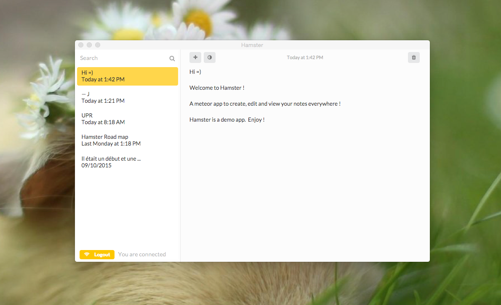

# Welcome to Hamster !



Hamster? What's this?
A meteor app to create, edit and view your notes everywhere !

Meteor? What's this?
Meteor is a complete open source platform for building web and mobile apps in pure JavaScript. [https://www.meteor.com/](https://www.meteor.com/) .

Instal :

1 - Install meteor.

2 - Download hamster.

3 - Run it locally:
```bash
cd hamster
meteor
```
